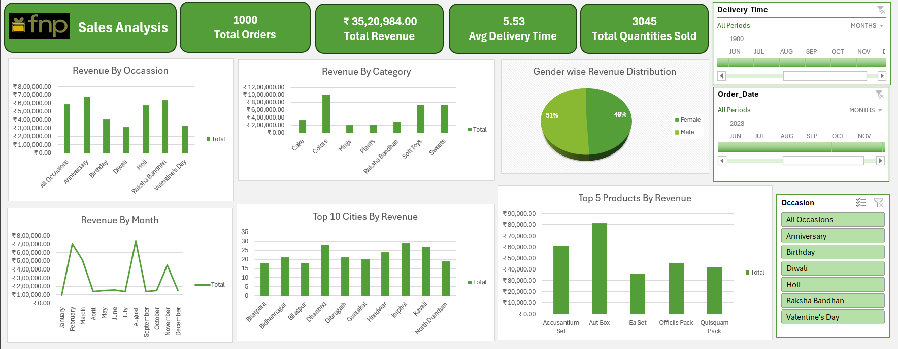

# 🌸 Ferns N Petals (FNP) Sales Analysis Dashboard

## 📌 Project Overview
Ferns N Petals (FNP) is a leading online gifting platform that delivers personalized gifts, flowers, and hampers for special occasions like Valentine’s Day, Raksha Bandhan, Diwali, and Birthdays.  
This project analyzes FNP’s 2023 sales data to uncover insights into **customer behavior, product performance, and city-wise demand**.  
An interactive dashboard was built in **Microsoft Excel** to visualize sales performance, delivery efficiency, and revenue trends — helping the company make **data-driven business decisions**.

---

## 📂 Dataset Description
The project uses three CSV files containing structured data on orders, products, and customers.

**1. orders.csv**  
- Order ID, Customer ID, Product ID  
- Order Date, Delivery Date  
- Quantity  

**2. products.csv**  
- Product ID, Product Name  
- Category (e.g., Flowers, Soft Toys, Chocolates)  
- Price, Occasion  

**3. customers.csv**  
- Customer ID, Customer Name  
- City  

➡️ The dataset includes **1,000 rows of transactional data**, providing insights into sales, delivery performance, and customer trends across multiple cities and product categories.

---

## 🛠️ Data Preparation & Analysis Workflow
The project followed a structured data analytics workflow in **Microsoft Excel**:

1. **Data Extraction** – Imported `orders.csv`, `products.csv`, and `customers.csv` into Excel.  
2. **Data Cleaning & Transformation** – Used *Power Query* to remove duplicates, handle nulls, and correct data types.  
3. **Data Modeling** – Created a **Star Schema**:
   - **Fact Table:** Orders (Order ID, Product ID, Customer ID, Quantity, Dates, Revenue)
   - **Dimension Tables:** Products and Customers
4. **Pivot Table Analysis** – Built multiple PivotTables to summarize revenue, delivery time, product performance, and city-level sales.
5. **Dashboard Creation** – Used Pivot Charts, Slicers, and Conditional Formatting to design an **interactive dashboard**.

---

## 🎯 Business Objectives
The dashboard was designed to answer key business questions:
- What is the total revenue and number of orders?
- What are the top-performing products and categories?
- Which occasions drive the most revenue?
- Which cities have the highest number of orders?
- How does order quantity affect delivery time?
- What is the average order-to-delivery time?

---

## 📊 Key Insights
- 💰 **Total Revenue:** ₹35,20,984 from 1,000 orders  
- ⏱️ **Average Delivery Time:** 5.53 days  
- 🏙️ **Top Cities:** Imphal, Kavali, and Dhanbad  
- 🎁 **Top Products:** *Aut Box*, *Accusantium Set*, and *Officiis Pack*  
- 💃 **Gender-wise Revenue:** Female customers – 51%, Male customers – 49%  
- 📅 **Seasonal Trends:** February and August show sales peaks due to Valentine’s Day and Raksha Bandhan  
- 🎨 **Top Categories:** Soft Toys, Sweets, and Colors lead in revenue  

---

## 💡 Business Recommendations
- 📈 **Seasonal Campaigns:** Focus marketing during Valentine’s and Raksha Bandhan months.  
- 🎯 **Product Strategy:** Expand top-selling categories like Sweets and Soft Toys.  
- 🏘️ **Regional Targeting:** Run promotional offers in high-performing cities.  
- 🤝 **Customer Loyalty:** Launch rewards or bundled offers to increase retention.  
- 🚚 **Operational Efficiency:** Reduce delivery time below 5 days for higher satisfaction.

---

## 🧰 Tools & Technologies
- **Microsoft Excel**
  - Power Query
  - PivotTables & Charts
  - Slicers & Conditional Formatting  
- **Data Sources:** `orders.csv`, `products.csv`, `customers.csv`

---

## 📎 Conclusion
The **FNP Sales Analysis Dashboard** provides a comprehensive overview of the company’s sales landscape.  
It identifies high-revenue occasions, top-performing products, and regional strengths, offering valuable insights for marketing, operations, and customer engagement strategies.

---

## 📸 Dashboard Preview

---

## ⭐ How to Use
1. Clone or download this repository.  
2. Open the Excel file and enable macros (if prompted).  
3. Explore interactive visuals using slicers and filters.  
4. Modify or extend datasets to perform your own analysis.

---

### 🏁 End of Project
If you find this project insightful, don’t forget to ⭐ **star** the repository and share your feedback!
